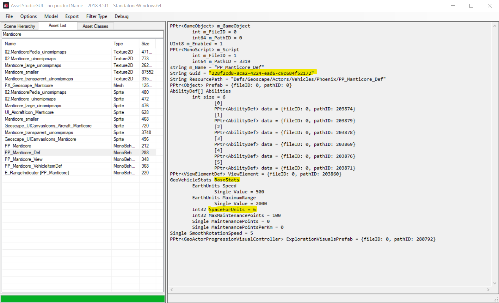

# Phoenix Point Def Modifier

This mod allows easy edits to some game values in Phoenix Point without needing to build a full mod for each one. The values to change are put into a configuration file and the file is read an applied when the game loads. If you are familiar with INI mods in XCOM games, this can do something similar. Unfortunately this is not quite as straightforward as .ini modding - a big part of making this useful is _finding_ the value you want to change and this is currently not very easy.


## Warning

Phoenix Point doesn't have official mod support. This mod may break or your own config mods may stop working whenever the game is patched, leaving your campaign in an inconsistent and maybe unplayable state.

Hacking up the defs can also cause unexpected behaviour in the game. Before you report a bug please make sure you verify with an unmodded game, otherwise you may just be making life much more difficult for the devs. They don't need to waste time trying to figure out how something that should be impossible in the base game has happened because you made it possible with a mod.

## What can be changed?

Many game constants can be changed by this mod. Some examples are:

- Carrying capacity of vehicles/aircraft
- Cost of equipment or recruits
- Equipment values like armor values, magazine sizes, etc.
- Difficulty level settings, such as whether or not new recuits come with equipment.
- Enabling/disabling the console

## What cannot be changed?

This system won't let you make changes to game code itself, like changing how an ability works. This kind of change would currently require a full DLL mod.

## How easy is it to use?

Easier than making a C# mod, but finding the things to change is currently tough.

## Why not use separate C# mods instead of this weird config file scheme?

First because it's easier - you don't need VS or to know how to build a C# project, you just need a text editor. Downloading DLLs also has some risk and requires you to trust the author (or to read the source and rebuild the DLL yourself). This method requires only trusting the base mod and each actual change is just a text description. It also can help you make mods _like_ an existing one by changing values or related assets instead of having to wait for someone to build that mod.

# Installation

This mod requires the [Phoenix Point Mod Injector](https://github.com/RealityMachina/PhoenixPointModInjector). Install this first.

Copy `PPDefModifier.dll` to your `Mods` folder created by the Mod Injector. Create a `PPDefModifier.json` configuration file in this same folder, next to the DLL. This file describes the changes you want to make. See below for the configuration file format and some sample fields.

# Quickstart configuration

For the mod to do anything you must provide one or more config files that list the changes you want to apply to the game. The mod will read all .json files in a folder named `PPDefModifier` in the `Mods` folder, including those in other subdirectories, applying all mods found in each file. This is the preferred mechanism to write mods that are small and easy to share. For backward compatibility with the first release the mod will also read a file named `PPDefModifier.json` in the `Mods` directory if it exists.

Each config file may contain a list of mods to apply, where each one has:

- Either a guid for the asset to change or the class name of a static field to change
- The name of the field you want to change within that asset or class
- The new value you want to set for this field

## Sample file

```json
[
    {
        "cls": "Base.Utils.GameConsole.GameConsoleWindow",
        "field": "DisableConsoleAccess",
        "value": 0,
        "comment": "Enable console access"
    },
    {
        "guid": "228f2cd8-8ca2-4224-ead6-c9c684f52172",
        "field": "BaseStats.SpaceForUnits",
        "value": 8,
        "comment": "Set Manticore carrying capacity to 8"
    }
]
```

This example file contains two mods:

The first enables console access by changing the value of the static field `DisableConsoleAccess` within the class `Base.Utils.GameConsole.GameConsoleWindow` to `false` (0).

The second entry changes the carrying capacity of the Manticore to 8 soldiers. The Manticore is identified by the guid `"228f2cd8-8ca2-4224-ead6-c9c684f52172"`, and the carrying capacity is within the `BaseStats` struct in a field named `SpaceForUnits`.

Each mod needs one of either `cls` or `guid`. `value` and `field` are required in all mods. `comment` is optional and allows you to provide a human-readable description of the mod, especially useful for guids.

If you are unfamiliar with Json: When building your own configuration file the square brackets `[` and `]` are needed, even when writing only one mod. Each mod definition goes in curly braces `{` `}`, and are separated by commas. There should be no comma after the last entry before the closing `]`. It may be helpful to paste the file into a Json validator (available online) to make sure it's a valid json file.

## Troubleshooting

First, note that changing some values may require a new campaign to take effect. These mods change the base value from the game, but any instances that have already been created in your save may still have the old value. Depending on exactly what the mod changes you may be able to just wait until new instances are generated (building new equipment, for example) without needing a whole new campaign.

The mod will write log information if it fails to read your config file or fails to apply a mod. The log file can be found
in `Users\YourUsername\AppData\LocalLow\Snapshot Games Inc\Phoenix Point\outlog_log.txt`, search for "PPDefModifier" for logs from the mod that will hopefully point you at what has gone wrong. If the log just indicates the file failed to parse you may have an error in your file. Pasting it into a Json validator site may help to find errors in your config.

# Finding the definitions to change

The biggest difficulty is in _finding_ where the thing you want to change is in the game files. There is no single method
to this that will always work, there is some detective work involved. Some possibilities are:

- The value is stored in an asset, like the Manticore size above. Most values for soldiers, enemies, equipment, etc are probably in here. Finding the thing you want to change will likely involve looking through the asset files and just searching for names that sound likely.
- The value is stored in a field somewhere in the game code, like the console mod above. This is fairly rare. Finding such a value will require digging around in a program like `dnSpy`.
- The value is hardcoded into the game code itself. Such values can't be changed by this mod, but you may be able to change the code behaviour with a full C# mod. Again `dnSpy` can help you to find out where this is, but this mod won't be able to modify it.

## Tools for finding assets and code values

Some useful tools for locating the values and/or assets are [dnSpy](https://github.com/0xd4d/dnSpy) to inspect the game code or an asset viewer such as [AssetStudio](https://github.com/Perfare/AssetStudio). Note that the main AssetStudio project can't process some of the Phoenix Point asset definitions. Until this is fixed in that project you can use my fork of the project that fixes the problem. See [here](https://github.com/tracktwo/AssetStudio). The release page has a binary build with the patch.

### Using AssetStudio to find Assets

Many game assets are stored in the `sharedassets0.assets` file in the `PhoenixPointWin64_Data` folder for the game. The latest release of AssetStudio as well as the Unity Asset Bundle Extractor both have issues reading the Phoenix Point asset files, especially for equipment. See the section above for a link to a patched AssetStudio that can read these files.

To search for assets select "Open File" from the File menu in AssetStudio and select the `sharedassets0.assets` file. In the `Asset List` tab enter a search word in the text box below the tab, and select the entry that looks like it might be the one you want. After choosing a dialog will pop up asking you to select the Assembly folder. Select the `Managed` folder under `PhoenixPointWin64_Data` and click "Select Folder".

The following screenshot shows an example for the Manticore capacity mod:



The entry in the asset list is named `PP_Manticore_Def`. The fields you are interested in will usually be of type `MonoBehaviour`, but the names may be hard to guess and may require either poking around in dnSpy or just searching for
likely names and seeing if anything useful pops up. They will usually be named with `_Def` on the end, possibly with another word such as `_EquipmentDef` or `_WeaponDef`.

The highlighted lines are the ones that you need to build the mod config. The first highlighted line shows the guid. This is always named `Guid` and is the value to use in the `guid` field of the mod. The next two show the path to the value we want to change. `SpaceForUnits` has the value 6, so that looks like the one we want. It is indented in the dump, showing that this field is not directly within the object itself but is nested within a field called `BaseStats`. The `field` value to use is the names of any nested objects separted by `.` followed by the name of the field to change itself. In this case, `"BaseStats.SpaceForUnits"`, and the `value` field can be set to the value you want (in this example, 8):

```json
{
    "guid": "228f2cd8-8ca2-4224-ead6-c9c684f52172",
    "field": "BaseStats.SpaceForUnits",
    "value": 8,
    "comment": "Optional string describing this mod"
}
````

# Configuration File Format Reference

Mod configuration files are json files. This mod will read all .json files in the `PPDefModifier` directory under `Mods` or any subdirectory within it, as well as a file named `PPDefModifier.json` if it exists in the `Mods` directory directly. Placing individual mod configuration files in a `PPDefModifier` directory or a subdirectory below it is the preferred method, the `PPDefModifier.json` file in the `Mods` directory is for backwards compatibility with the original release.

Each configuration file must contain an array defining the mod objects. Each mod in the array has the following fields:

### guid

The `guid` field is necessary when making a change to a game object that is implemented as an asset and should be set to a string containing the guid of the definition. See below for a guide on how to read the assets and find entries you may be looking for.

Exactly one of `guid` or `cls` must be in each mod.

### cls

The `cls` field is necessary when making a change to a game value that is not stored as an asset, e.g. the flag that disables the console. The `cls` field should be a fully-qualified class name with all namespaces. The `field` field of the mod should name a static field of this class that you wish to change.

### field

The `field` field specifies the name of the field to change and should name a field of some primitive type (e.g. an integer, float, or boolean value). Handling other values (such as references to other assets) will hopefully come soon. For `cls` type mods `field` should name a static member of the class. For `guid` type mods it does not need to be static.

### Value

The new number to set the field to. Booleans can be specified as 1 (true) or 0 (false).

### Comment

An optional field used to describe the mod, since json does not support comments. Especially useful for guid mods to describe what the guid refers to.

# Future Work

- Find out if its possible to specify assets by path instead of by guid for more readability
- Add support for more data types, e.g. defs that refer to other defs
